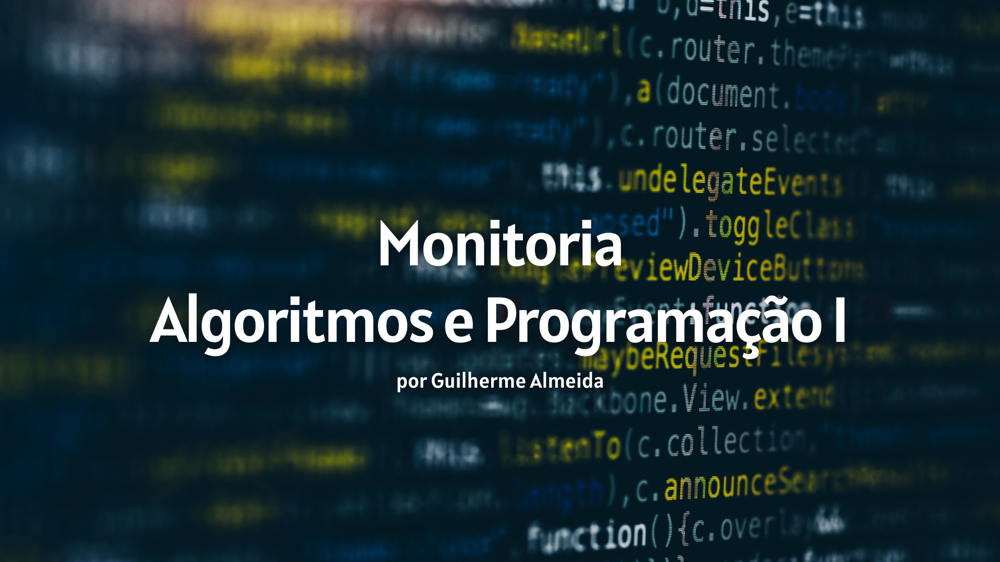

# Seja bem vindo à Monitoria!

Fala aí, tudo beleza? Seja bem vindo ao repositório oficial da Monitoria de Algoritmos e Programação I !

Aqui você vai encontrar bastante coisa, desde códigos de exemplo sobre um determinado assunto, exercícios e listas resolvidos, links para conteúdos extras sobre a disciplina, sobre Python e sobre Programação em geral.

Esse repositório está divido em várias partes, sendo elas:

- Saídas, Variáveis e Entrada
- Matemática Básica e Matemática com Variáveis
- Iterações
- Seleção
- Listas
- Subrotinas

## Contato

- Telefone: (67) 99154-3111
- Email Institucional: guilherme_almeida@ufms.br
- Instagram: therealguilhermealmeida

